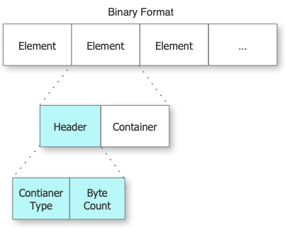
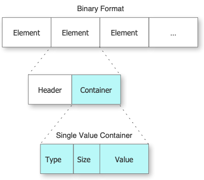
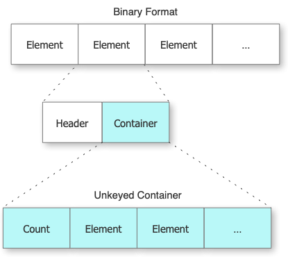
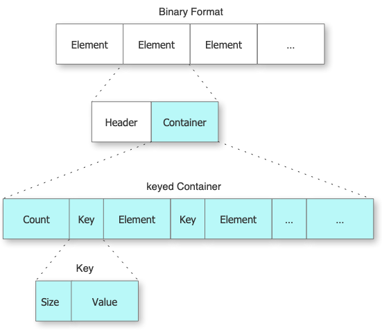

# Binary Format

The internal binary representation of the encoded data consists of a series of **Elements** each containing a **Header** section followed by a **Container**.  The Element is essentially a wrapper around a Container defining it's type and size in bytes. The format was designed to be as compact and efficient as possible at storing the simplest to the most complex structures that can be encoded.

The Header of each Element contains a 32 bit integer representing the container type followed by a 32 integer containing the total number of bytes stored in the Container section of this Element.

## Containers
Each Container formats it's data based on the requirements of that container. There are 3 container types that can be stored corresponding to the `Encoder` and `Decoder` protocol return types for the functions `singleValueContainer()`, `unkeyedContainer()`, and `container(keyedBy:)`. An Element is created in response to each call to any one of these functions.

### Single Value Container

Each SingleValueContainer is defined by the Container structure below.
SingleValueContainers consist of the encoded type of the value it stores, the size in bytes of the value, and the value itself.

### Unkeyed Container

An unkeyed container consists of the count of the number of elements it stores and a series of the elements
containing other containers.

### Keyed Container

A keyed container consists of the count of the number of key/Element pairs contained in the container followed by a key and Element for each.

Each key consists of the size in bytes of the string for the key and the value of the string itself.

> Note: Keys are not null terminated.

## Memory Alignment

Currently StickyEncoding aligns the data in the file and in memory aligned to the machine it is running on.

## Byte ordering

StickyEncoding uses the same byte order as the machine that the binary data is created on uses.

